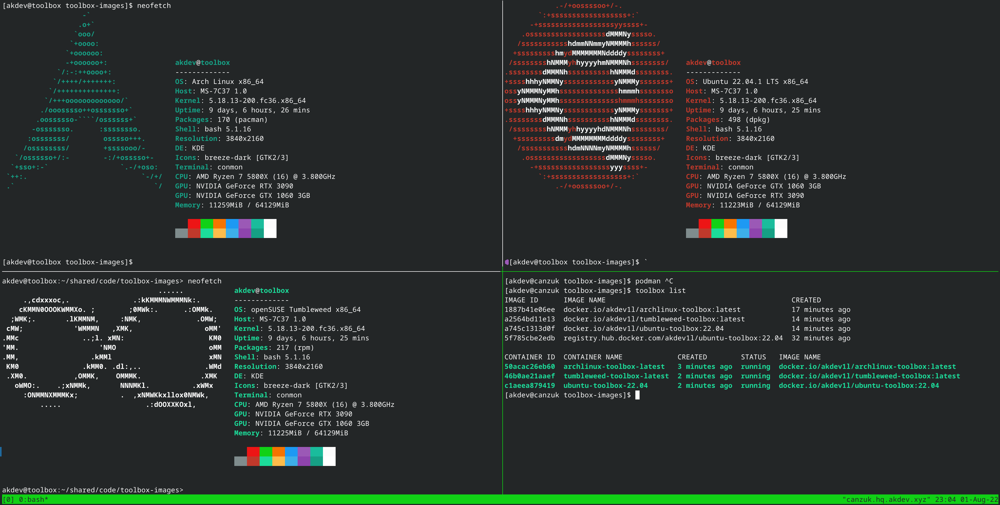

#### Toolbox Images: Container Images for usage with [toolbox](https://github.com/containers/toolbox)

Here we have a collection of container images for usage with the `toolbox` command. This is an attempt at providing more
feature parity with regard to toolboxes for distributions other than Fedora.

### Supported Distributions

1. Ubuntu - `docker.io/akdev1l/ubuntu-toolbox:22.04`
2. Arch Linux - `docker.io/akdev1l/archlinux-toolbox:latest`
3. OpenSuSE Tumbleweed - `docker.io/akdev1l/tumbleweed-toolbox:latest`




### How do I use this?

You can use the images by doing `toolbox create -i docker.io/akdev1l/${distro}-toolbox:${version}`, for example:

```
[akdev@canzuk toolbox-images]$ toolbox create -i docker.io/akdev1l/ubuntu-toolbox:22.04                  
Created container: ubuntu-toolbox-22.04                                                                               
Enter with: toolbox enter ubuntu-toolbox-22.04                                                                        
[akdev@canzuk toolbox-images]$ toolbox enter ubuntu-toolbox-22.04
```

**Note: For Rolling Release distributions like Arch Linux and OpenSuSE Tumbleweed the version is always `latest`.**

### Prior Work

1. [Original Containerfiles](https://github.com/MainKt/toolbox/tree/main/images) Thanks to [Main.kt](https://github.com/MainKt).
